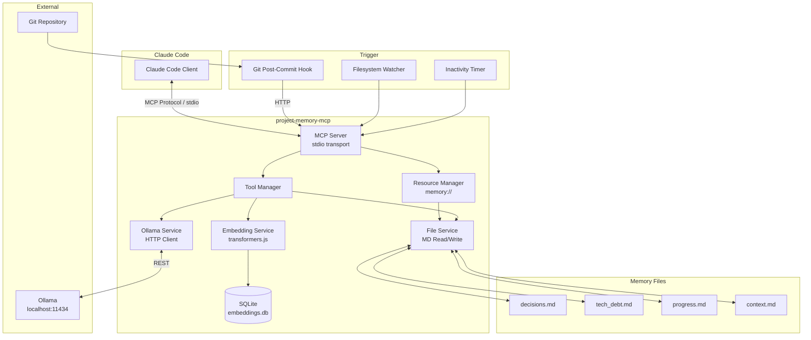
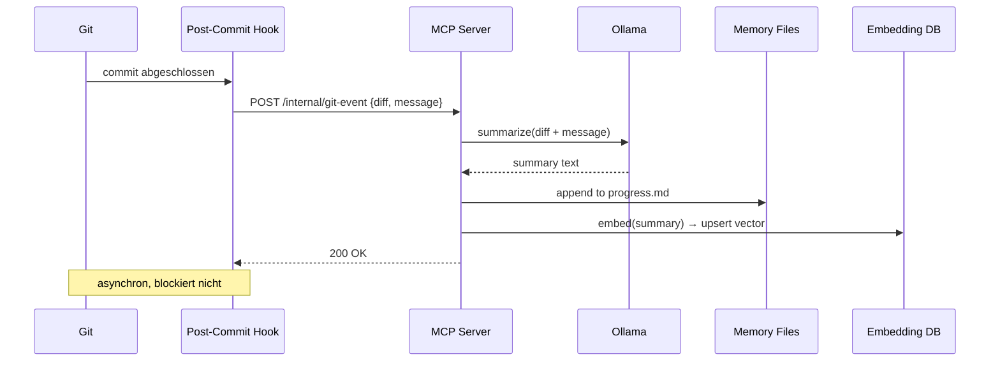

# requirements.md — project-memory-mcp

> Persistente Wissensbasis für AI-gestützte Entwicklung via Model Context Protocol

**Version:** 0.1.0
**Stand:** 2026-03-12
**Status:** Draft

---

## Inhaltsverzeichnis

1. [Projektziele & Erfolgskriterien](#1-projektziele--erfolgskriterien)
2. [Funktionale Anforderungen](#2-funktionale-anforderungen)
3. [Nicht-funktionale Anforderungen](#3-nicht-funktionale-anforderungen)
4. [Technische Architektur](#4-technische-architektur)
5. [Schnittstellen & Protokolle](#5-schnittstellen--protokolle)
6. [Konfiguration](#6-konfiguration)
7. [Implementierungsplan](#7-implementierungsplan)
8. [Offene Fragen & Risiken](#8-offene-fragen--risiken)

---

## 1. Projektziele & Erfolgskriterien

### Problemstellung

Sitzungsbasierte AI-Assistenten (Claude, GPT, etc.) leiden unter "Amnesie": Jede neue
Konversation beginnt ohne Wissen über vergangene Entscheidungen, technische Schulden
oder den Projektfortschritt. Dies führt zu inkonsistenten Designentscheidungen und
wiederholten Erklärungen über lange Entwicklungszeiträume.

### Primäre User Stories

| ID | Als... | möchte ich... | damit... |
|----|--------|---------------|----------|
| US-01 | Entwickler | dass Claude meine Architekturentscheidungen aus vergangenen Sessions kennt | keine bereits verworfenen Ansätze erneut vorgeschlagen werden |
| US-02 | Entwickler | technische Schulden automatisch erfasst sehen | nichts in Vergessenheit gerät |
| US-03 | Entwickler | den Projektfortschritt per AI abrufbar haben | ich jederzeit einen Statusüberblick bekomme |
| US-04 | Entwickler | dass Memory-Updates automatisch nach Git-Commits passieren | ich keinen manuellen Pflegeaufwand habe |
| US-05 | Entwickler | semantisch in der Wissensbasis suchen können | ich relevanten Kontext schnell finde |
| US-06 | Team | die Wissensbasis im Repository versioniert haben | alle Teammitglieder denselben Kontext haben |

### Erfolgskriterien (Definition of Done)

- [ ] MCP Server startet und registriert sich erfolgreich in Claude Code
- [ ] Nach einem Git-Commit wird die Memory automatisch aktualisiert (< 30s)
- [ ] Claude kann via MCP Resource die Wissensbasis ohne explizite Anfrage einlesen
- [ ] Semantische Suche liefert relevante Treffer mit cosine similarity > 0.7
- [ ] Vollständig offline nutzbar (kein Cloud-API-Key erforderlich)
- [ ] Konfiguration per `.project-memory/config.yaml` möglich

### Out of Scope

- Cloud-Sync oder zentrale Datenbank (ausschließlich lokal)
- VS Code Extension oder andere IDE-Integrationen
- Unterstützung für andere Programmiersprachen als TypeScript/Node.js im Core
- Echtzeit-Kollaboration zwischen mehreren parallelen Sessions
- Automatisches Löschen oder Archivieren von Memory-Einträgen

---

## 2. Funktionale Anforderungen

### 2.1 MCP Server Lifecycle

| ID | Anforderung | Priorität | Akzeptanztest |
|----|-------------|-----------|---------------|
| F-01 | Der Server startet als stdio-basierter MCP Server | Must | `npx project-memory-mcp` registriert sich in Claude Code |
| F-02 | Der Server liest Konfiguration aus `.project-memory/config.yaml` beim Start | Must | Fehlende Konfig erzeugt Defaults, keine Absturz |
| F-03 | Der Server initialisiert `.project-memory/` Verzeichnis bei erstem Start | Must | Alle Memory-Dateien werden angelegt |
| F-04 | Der Server loggt Fehler strukturiert (JSON) in `.project-memory/server.log` | Should | Fehler sind nachvollziehbar ohne Console-Zugriff |
| F-05 | Graceful Shutdown: laufende Summarization wird abgeschlossen | Should | Kein Datenverlust bei SIGTERM |

### 2.2 Memory Read — MCP Resources

| ID | Anforderung | Priorität | Akzeptanztest |
|----|-------------|-----------|---------------|
| F-10 | `memory://decisions` Resource liefert Inhalt von `decisions.md` | Must | Claude liest Architekturentscheidungen ohne Tool-Call |
| F-11 | `memory://tech-debt` Resource liefert Inhalt von `tech_debt.md` | Must | Claude liest Tech-Debt ohne Tool-Call |
| F-12 | `memory://progress` Resource liefert Inhalt von `progress.md` | Must | Claude liest Projektfortschritt ohne Tool-Call |
| F-13 | `memory://context` Resource liefert Inhalt von `context.md` | Must | Claude liest Domain-Wissen ohne Tool-Call |
| F-14 | Resources werden bei Dateiänderung automatisch aktualisiert | Should | Resource-Inhalt nach Schreiboperation sofort aktuell |

### 2.3 Memory Write — MCP Tools

| ID | Anforderung | Priorität | Akzeptanztest |
|----|-------------|-----------|---------------|
| F-20 | `add_decision` Tool schreibt ADR-Eintrag in `decisions.md` | Must | Eintrag mit Datum, Titel, Kontext, Entscheidung, Konsequenzen |
| F-21 | `log_tech_debt` Tool schreibt Eintrag in `tech_debt.md` | Must | Eintrag mit Schweregrad, Beschreibung, betroffene Dateien |
| F-22 | `update_progress` Tool aktualisiert `progress.md` | Must | Meilenstein mit Status (done/in-progress/planned) |
| F-23 | `add_context` Tool schreibt in `context.md` | Must | Freiform-Kontext mit Kategorie-Tag |
| F-24 | Alle Write-Tools geben den geschriebenen Eintrag als Bestätigung zurück | Should | Keine "blindes" Schreiben |
| F-25 | Write-Operationen sind idempotent (kein Duplikat bei Wiederholung) | Could | Gleicher Inhalt doppelt aufgerufen → kein Duplikat |

### 2.4 Memory Search

| ID | Anforderung | Priorität | Akzeptanztest |
|----|-------------|-----------|---------------|
| F-30 | `search_memory` Tool nimmt Freitext-Query entgegen | Must | Query liefert Top-5 semantisch relevante Einträge |
| F-31 | Suchergebnisse enthalten Quelldatei, Abschnitt und Similarity-Score | Must | Treffer sind nachvollziehbar verortet |
| F-32 | Neue Einträge werden automatisch in den Embedding-Index aufgenommen | Must | Neuer Eintrag ist sofort durchsuchbar |
| F-33 | `search_memory` unterstützt optionalen `scope`-Filter (decisions/tech_debt/...) | Should | Suche auf einzelne Memory-Datei einschränkbar |

### 2.5 Git-Integration

| ID | Anforderung | Priorität | Akzeptanztest |
|----|-------------|-----------|---------------|
| F-40 | Post-Commit-Hook wird bei `init` automatisch in `.git/hooks/` installiert | Must | Nach `git commit` wird Summarization ausgelöst |
| F-41 | Hook sendet Diff + Commit-Message an Ollama zur Zusammenfassung | Must | Relevante Änderungen landen in `progress.md` |
| F-42 | Hook überspringt Commits mit `[skip-memory]` im Message | Should | Opt-out pro Commit möglich |
| F-43 | Hook läuft asynchron (blockiert `git commit` nicht) | Must | `git commit` dauert nicht länger als ohne Hook |
| F-44 | Hook-Fehler werden geloggt, brechen Commit nicht ab | Must | Commit gelingt auch wenn Ollama nicht erreichbar |

### 2.6 Session-Management

| ID | Anforderung | Priorität | Akzeptanztest |
|----|-------------|-----------|---------------|
| F-50 | Server erkennt Inaktivität nach konfigurierbarem Timeout (Default: 30min) | Should | Session-Ende wird detektiert |
| F-51 | Bei Session-Ende wird Zusammenfassung der letzten Tool-Calls generiert | Should | `progress.md` erhält Session-Summary |
| F-52 | Session-Zusammenfassung enthält: Datum, Dauer, geänderte Dateien, Entscheidungen | Should | Nachvollziehbarer Session-Log |

### 2.7 Filesystem-Watcher

| ID | Anforderung | Priorität | Akzeptanztest |
|----|-------------|-----------|---------------|
| F-60 | Watcher beobachtet konfigurierbare Pfade (Default: `CLAUDE.md`, `docs/adr/`) | Should | Änderungen triggern Memory-Update |
| F-61 | Geänderte Datei wird per Ollama zusammengefasst und in `context.md` geschrieben | Should | Neuer Kontext-Eintrag nach Dateiänderung |
| F-62 | Watcher ignoriert `.project-memory/` Verzeichnis (kein Rekursions-Loop) | Must | Keine Endlosschleife durch eigene Schreiboperationen |

### 2.8 Ollama-Integration

| ID | Anforderung | Priorität | Akzeptanztest |
|----|-------------|-----------|---------------|
| F-70 | Server prüft Ollama-Verfügbarkeit beim Start | Must | Klare Fehlermeldung wenn Ollama nicht läuft |
| F-71 | Ollama-Modell ist per Config wählbar (Default: `llama3.2`) | Must | Modellwechsel ohne Code-Änderung |
| F-72 | Bei Ollama-Fehler: Fallback auf Keyword-Extraktion (kein LLM) | Should | Grundfunktion bleibt ohne Ollama erhalten |
| F-73 | Ollama-Timeout konfigurierbar (Default: 60s) | Should | Kein ewiges Warten bei hängendem Modell |

### 2.9 Embedding-Pipeline

| ID | Anforderung | Priorität | Akzeptanztest |
|----|-------------|-----------|---------------|
| F-80 | Embeddings werden mit `transformers.js` (all-MiniLM-L6-v2) lokal berechnet | Must | Keine externe API für Embeddings nötig |
| F-81 | Vektoren werden in SQLite gespeichert (`.project-memory/embeddings.db`) | Must | Persistenz über Server-Neustarts |
| F-82 | Re-Indexierung des gesamten Memory auf Befehl (`reindex_memory` Tool) | Should | Konsistenz nach manuellen Dateiänderungen |
| F-83 | Embedding-Modell wird beim ersten Start automatisch heruntergeladen | Must | Kein manueller Setup-Schritt |

---

## 3. Nicht-funktionale Anforderungen

### Performance

| Metrik | Zielwert | Begründung |
|--------|----------|------------|
| MCP Tool Response (Read) | < 200ms | Keine spürbare Verzögerung in Claude |
| MCP Tool Response (Write) | < 500ms | Schreiben inkl. Embedding-Update |
| Semantische Suche | < 300ms | Inkl. Embedding der Query |
| Ollama Summarization | < 60s (Timeout) | Asynchron, blockiert nicht |
| Server-Startzeit | < 3s | Inkl. SQLite-Init und Ollama-Check |
| Embedding-Indexierung (neu) | < 2s pro Eintrag | |

### Skalierbarkeit

- Bis zu **10.000 Memory-Einträge** ohne Performance-Degradierung
- Memory-Dateien bis **1 MB** pro Datei ohne Probleme handhabbar
- SQLite-Datenbank bis **500 MB** unterstützt

### Sicherheit

- Keine Credentials, API-Keys oder Passwörter in Memory-Dateien speichern
- `.project-memory/` wird automatisch in `.gitignore` eingetragen (außer `*.md`)
- `embeddings.db` und `server.log` landen in `.gitignore`
- Pfad-Traversal-Angriffe bei Filesystem-Watcher verhindern
- Ollama-Kommunikation ausschließlich über localhost

### Portabilität

- macOS (arm64, x86_64)
- Linux (Ubuntu 22.04+, Debian 12+)
- Windows via WSL2
- Node.js >= 20 LTS

### Offline-Fähigkeit

- Kein Internet-Zugriff zur Laufzeit erforderlich
- Einmaliger Download des Embedding-Modells beim ersten Start
- Ollama läuft lokal

---

## 4. Technische Architektur

### Komponentendiagramm



### Datenfluss: Git-Commit → Memory Update



### Projektstruktur

```
project-memory-mcp/
├── src/
│   ├── index.ts              # Einstiegspunkt, MCP Server Setup
│   ├── server.ts             # MCP Server Konfiguration
│   ├── resources/
│   │   └── memory.ts         # MCP Resource Handler (memory://)
│   ├── tools/
│   │   ├── read.ts           # get_memory, search_memory
│   │   ├── write.ts          # add_decision, log_tech_debt, etc.
│   │   └── admin.ts          # reindex_memory
│   ├── services/
│   │   ├── ollama.ts         # Ollama HTTP Client
│   │   ├── embedding.ts      # transformers.js Wrapper
│   │   ├── file.ts           # MD File I/O
│   │   └── git.ts            # simple-git Integration
│   ├── triggers/
│   │   ├── git-hook.ts       # HTTP Endpoint für Post-Commit Hook
│   │   ├── watcher.ts        # Filesystem Watcher (chokidar)
│   │   └── session.ts        # Inactivity Timer
│   ├── config.ts             # Config laden & validieren
│   └── types.ts              # Gemeinsame TypeScript-Typen
├── hooks/
│   └── post-commit           # Shell-Script für Git Hook
├── .project-memory/          # Wird im Zielprojekt erstellt
│   ├── decisions.md
│   ├── tech_debt.md
│   ├── progress.md
│   ├── context.md
│   ├── embeddings.db
│   ├── server.log
│   └── config.yaml
├── package.json
├── tsconfig.json
└── README.md
```

### SQLite Datenbankschema

```sql
CREATE TABLE embeddings (
    id          TEXT PRIMARY KEY,        -- SHA256 des Inhalts
    source_file TEXT NOT NULL,           -- 'decisions' | 'tech_debt' | 'progress' | 'context'
    section     TEXT NOT NULL,           -- Markdown-Abschnitt (Überschrift)
    content     TEXT NOT NULL,           -- Originaler Text
    vector      BLOB NOT NULL,           -- Float32Array als BLOB
    created_at  INTEGER NOT NULL,        -- Unix Timestamp
    updated_at  INTEGER NOT NULL
);

CREATE INDEX idx_source_file ON embeddings(source_file);
CREATE INDEX idx_created_at ON embeddings(created_at);
```

---

## 5. Schnittstellen & Protokolle

### MCP Resources

| URI | MIME-Type | Beschreibung |
|-----|-----------|--------------|
| `memory://decisions` | `text/markdown` | Architekturentscheidungen (ADRs) |
| `memory://tech-debt` | `text/markdown` | Technische Schulden |
| `memory://progress` | `text/markdown` | Projektfortschritt & Meilensteine |
| `memory://context` | `text/markdown` | Domain-Wissen & Konventionen |

### MCP Tools — JSON Schema

#### `add_decision`
```json
{
  "name": "add_decision",
  "description": "Speichert eine Architekturentscheidung (ADR) in der persistenten Wissensbasis",
  "inputSchema": {
    "type": "object",
    "required": ["title", "decision", "context"],
    "properties": {
      "title":        { "type": "string", "description": "Kurzer Titel der Entscheidung" },
      "context":      { "type": "string", "description": "Problem / Ausgangssituation" },
      "decision":     { "type": "string", "description": "Getroffene Entscheidung" },
      "consequences": { "type": "string", "description": "Konsequenzen und Trade-offs" },
      "status":       { "type": "string", "enum": ["proposed", "accepted", "deprecated"], "default": "accepted" }
    }
  }
}
```

#### `log_tech_debt`
```json
{
  "name": "log_tech_debt",
  "description": "Erfasst technische Schulden oder bekannte Probleme",
  "inputSchema": {
    "type": "object",
    "required": ["description", "severity"],
    "properties": {
      "description":    { "type": "string", "description": "Beschreibung der technischen Schuld" },
      "severity":       { "type": "string", "enum": ["low", "medium", "high", "critical"] },
      "affected_files": { "type": "array", "items": { "type": "string" } },
      "ticket":         { "type": "string", "description": "Optionale Issue-Referenz (z.B. bd-abc1)" }
    }
  }
}
```

#### `update_progress`
```json
{
  "name": "update_progress",
  "description": "Aktualisiert den Projektfortschritt mit einem Meilenstein oder einer Statusänderung",
  "inputSchema": {
    "type": "object",
    "required": ["milestone", "status"],
    "properties": {
      "milestone":   { "type": "string", "description": "Name des Meilensteins" },
      "status":      { "type": "string", "enum": ["planned", "in-progress", "done", "blocked"] },
      "description": { "type": "string", "description": "Optionale Details" }
    }
  }
}
```

#### `add_context`
```json
{
  "name": "add_context",
  "description": "Speichert Domain-Wissen, Konventionen oder sonstigen Freitext-Kontext",
  "inputSchema": {
    "type": "object",
    "required": ["content"],
    "properties": {
      "content":  { "type": "string", "description": "Zu speichernder Kontext" },
      "category": { "type": "string", "description": "Kategorie-Tag (z.B. 'api', 'domain', 'convention')" }
    }
  }
}
```

#### `search_memory`
```json
{
  "name": "search_memory",
  "description": "Semantische Suche in der gesamten Wissensbasis",
  "inputSchema": {
    "type": "object",
    "required": ["query"],
    "properties": {
      "query":   { "type": "string", "description": "Suchanfrage in natürlicher Sprache" },
      "scope":   { "type": "string", "enum": ["decisions", "tech_debt", "progress", "context", "all"], "default": "all" },
      "top_k":   { "type": "integer", "minimum": 1, "maximum": 20, "default": 5 }
    }
  }
}
```

#### `reindex_memory`
```json
{
  "name": "reindex_memory",
  "description": "Re-indexiert alle Memory-Dateien in der Embedding-Datenbank",
  "inputSchema": {
    "type": "object",
    "properties": {
      "scope": { "type": "string", "enum": ["all", "decisions", "tech_debt", "progress", "context"], "default": "all" }
    }
  }
}
```

### Interner Git-Hook Endpoint

Der MCP Server öffnet einen lokalen HTTP-Server auf einem konfigurierbaren Port (Default: `47832`) ausschließlich für den Git-Hook:

```
POST http://localhost:47832/internal/git-event
Content-Type: application/json

{
  "event": "post-commit",
  "message": "feat: add user authentication",
  "diff": "...",
  "changed_files": ["src/auth.ts", "src/routes.ts"],
  "timestamp": 1741651200
}
```

### Ollama API — Verwendete Endpoints

| Endpoint | Methode | Verwendung |
|----------|---------|------------|
| `GET /api/tags` | GET | Verfügbarkeitsprüfung beim Start |
| `POST /api/generate` | POST | Summarization (streaming) |

---

## 6. Konfiguration

### `.project-memory/config.yaml`

```yaml
# project-memory-mcp Konfiguration
# Alle Werte sind optional — fehlende Werte werden mit Defaults befüllt

# Ollama-Einstellungen
ollama:
  base_url: "http://localhost:11434"  # Ollama API URL
  model: "llama3.2"                   # Zu verwendendes Modell
  timeout_seconds: 60                 # Timeout für Summarization-Requests
  fallback_to_keywords: true          # Bei Ollama-Fehler: Keyword-Extraktion als Fallback

# Embedding-Einstellungen
embeddings:
  model: "Xenova/all-MiniLM-L6-v2"   # transformers.js Modell-ID (HuggingFace)
  db_path: ".project-memory/embeddings.db"

# Git-Integration
git:
  hook_enabled: true                  # Post-Commit-Hook aktivieren
  hook_port: 47832                    # Lokaler Port für Hook-Kommunikation
  skip_keyword: "[skip-memory]"       # Commits mit diesem Keyword überspringen
  summarize_diffs: true               # Diffs an Ollama schicken

# Filesystem-Watcher
watcher:
  enabled: true
  paths:                              # Zu beobachtende Pfade (relativ zum Projektroot)
    - "CLAUDE.md"
    - "docs/adr/"
    - "README.md"
  debounce_ms: 2000                   # Wartezeit nach letzter Änderung vor Verarbeitung

# Session-Management
session:
  inactivity_timeout_minutes: 30      # Timeout für Session-Ende-Detection
  summarize_on_end: true              # Session-Zusammenfassung bei Ende

# Logging
logging:
  level: "info"                       # "debug" | "info" | "warn" | "error"
  file: ".project-memory/server.log"
  max_size_mb: 10

# Memory-Dateien
memory:
  base_dir: ".project-memory"
  files:
    decisions: "decisions.md"
    tech_debt: "tech_debt.md"
    progress:  "progress.md"
    context:   "context.md"
```

### Environment Variable Overrides

| Variable | Überschreibt | Beispiel |
|----------|-------------|---------|
| `PMM_OLLAMA_URL` | `ollama.base_url` | `http://192.168.1.10:11434` |
| `PMM_OLLAMA_MODEL` | `ollama.model` | `mistral` |
| `PMM_HOOK_PORT` | `git.hook_port` | `48000` |
| `PMM_LOG_LEVEL` | `logging.level` | `debug` |

---

## 7. Implementierungsplan

### Phase 1 — Core MCP Server (MVP) ✦ Priorität: Kritisch

**Ziel:** Funktionierender MCP Server mit manuellen Read/Write-Tools

- [ ] Projekt-Setup: TypeScript, MCP SDK, ESLint, Vitest
- [ ] `config.ts`: Laden und Validieren der Konfiguration
- [ ] `file.ts`: Read/Write für alle vier Memory-Dateien
- [ ] MCP Resources: `memory://decisions`, `memory://tech-debt`, `memory://progress`, `memory://context`
- [ ] MCP Tools: `add_decision`, `log_tech_debt`, `update_progress`, `add_context`
- [ ] Server-Initialisierung: `.project-memory/` Verzeichnis und Default-Dateien anlegen
- [ ] **MVP-Akzeptanztest:** Claude kann Memory lesen und schreiben

**Abhängigkeiten:** keine

### Phase 2 — Embedding & Suche

**Ziel:** Semantische Suche in der Wissensbasis

- [ ] `embedding.ts`: transformers.js Integration, Modell-Download
- [ ] SQLite-Schema anlegen, `embeddings.db` initialisieren
- [ ] Automatisches Embedding neuer Einträge nach Write-Operationen
- [ ] `search_memory` Tool implementieren
- [ ] `reindex_memory` Tool implementieren

**Abhängigkeiten:** Phase 1 abgeschlossen

### Phase 3 — Ollama-Integration

**Ziel:** Automatische Summarization via lokalem LLM

- [ ] `ollama.ts`: HTTP Client, Verfügbarkeitsprüfung, Streaming
- [ ] Summarization-Prompts für jede Memory-Kategorie
- [ ] Keyword-Extraktion als Fallback (kein LLM)
- [ ] Timeout-Handling und Fehlerbehandlung

**Abhängigkeiten:** Phase 1 abgeschlossen

### Phase 4 — Git-Integration

**Ziel:** Automatische Memory-Updates nach Commits

- [ ] Interner HTTP-Server für Hook-Kommunikation
- [ ] `git.ts`: simple-git Integration, Diff-Extraktion
- [ ] Post-Commit-Hook Shell-Script
- [ ] Hook-Installation bei `npx project-memory-mcp init`
- [ ] Asynchrone Verarbeitung (blockiert Commit nicht)

**Abhängigkeiten:** Phase 3 abgeschlossen

### Phase 5 — Filesystem-Watcher & Session-Management

**Ziel:** Vollständige Automatisierung ohne manuelle Eingriffe

- [ ] `watcher.ts`: chokidar Integration, Debouncing
- [ ] Konfigurierbare Watch-Pfade
- [ ] `session.ts`: Inaktivitäts-Timer, Session-Zusammenfassung
- [ ] Session-Summary wird in `progress.md` geschrieben

**Abhängigkeiten:** Phase 3 abgeschlossen

### MVP-Definition

Phase 1 allein ist ein nutzbarer MVP:
- Claude kann Memory lesen (via Resources, automatisch)
- Claude kann Memory schreiben (via Tools, auf Anforderung)
- Keine Automatisierung, aber vollständige manuelle Kontrolle
- Wert: Kontext-Persistenz über Sessions, auch ohne Embedding/Git

---

## 8. Offene Fragen & Risiken

### Technische Risiken

| Risiko | Wahrscheinlichkeit | Impact | Mitigation |
|--------|-------------------|--------|------------|
| transformers.js zu langsam in Node.js (WASM) | Mittel | Hoch | Benchmark früh, ggf. auf Python-Sidecar ausweichen |
| Ollama nicht auf Zielmaschine verfügbar | Hoch | Mittel | Keyword-Fallback (F-72) als Pflichtfeature |
| SQLite Locking bei parallelen Zugriffen | Niedrig | Mittel | WAL-Mode aktivieren, Write-Queue implementieren |
| MCP Resource-Größe überschreitet Kontextfenster | Mittel | Hoch | Zusammenfassungen kürzen, `top_k` limitieren |
| Git-Hook überschreibt bestehende Hooks | Niedrig | Mittel | Hook-Chaining implementieren, nicht ersetzen |

### Architektur-Entscheidungen (noch offen)

1. **Embedding-Chunking:** Wie werden lange Memory-Einträge für Embeddings aufgeteilt? (Satz-Level vs. Abschnitt-Level)
2. **Memory-Wachstum:** Ab welcher Dateigröße werden alte Einträge archiviert oder komprimiert?
3. **Multi-Projekt-Support:** Ein Server pro Projekt (aktueller Plan) oder ein globaler Server mit Projekt-Namespacing?
4. **Windows ohne WSL:** Native Windows-Unterstützung für Git-Hooks ist komplex — explizit ausschließen oder via PowerShell-Hook unterstützen?

### Validierungsannahmen

- Ollama mit llama3.2 liefert ausreichend gute Summarizations für Commit-Diffs (muss empirisch validiert werden)
- `all-MiniLM-L6-v2` Embeddings sind gut genug für Code-nahen Kontext (Alternative: `nomic-embed-text` via Ollama)
- MCP Resources werden von Claude Code tatsächlich automatisch in den Kontext geladen (MCP-Spec-Verhalten muss verifiziert werden)
