# requirements.md — project-memory-mcp

> Persistent knowledge base for AI-assisted development via Model Context Protocol

**Version:** 0.1.0
**Date:** 2026-03-12
**Status:** Draft

---

## Table of Contents

1. [Project Goals & Success Criteria](#1-project-goals--success-criteria)
2. [Functional Requirements](#2-functional-requirements)
3. [Non-Functional Requirements](#3-non-functional-requirements)
4. [Technical Architecture](#4-technical-architecture)
5. [Interfaces & Protocols](#5-interfaces--protocols)
6. [Configuration](#6-configuration)
7. [Implementation Plan](#7-implementation-plan)
8. [Open Questions & Risks](#8-open-questions--risks)

---

## 1. Project Goals & Success Criteria

### Problem Statement

Session-based AI assistants (Claude, GPT, etc.) suffer from "amnesia": every new conversation begins without knowledge of past decisions, technical debt, or project progress. This leads to inconsistent design decisions and repeated explanations over long development periods.

### Primary User Stories

| ID | As a... | I want to... | so that... |
|----|---------|--------------|------------|
| US-01 | Developer | have Claude know my architectural decisions from past sessions | already-rejected approaches are not suggested again |
| US-02 | Developer | see technical debt recorded automatically | nothing gets forgotten |
| US-03 | Developer | have project progress retrievable via AI | I can get a status overview at any time |
| US-04 | Developer | have memory updates happen automatically after git commits | I don't have to maintain it manually |
| US-05 | Developer | be able to search the knowledge base semantically | I can find relevant context quickly |
| US-06 | Team | have the knowledge base versioned in the repository | all team members share the same context |

### Success Criteria (Definition of Done)

- [x] MCP server starts and registers successfully in Claude Code
- [x] After a git commit, memory is updated automatically (< 30s)
- [x] Claude can read the knowledge base via MCP Resource without explicit request
- [x] Semantic search returns relevant results with cosine similarity > 0.7
- [x] Fully usable offline (no cloud API key required)
- [x] Configurable via `.project-memory/config.yaml`

### Out of Scope

- Cloud sync or central database (local only)
- VS Code extension or other IDE integrations
- Support for languages other than TypeScript/Node.js in the core
- Real-time collaboration between multiple parallel sessions
- Automatic deletion or archiving of memory entries

---

## 2. Functional Requirements

### 2.1 MCP Server Lifecycle

| ID | Requirement | Priority | Acceptance Test |
|----|-------------|----------|-----------------|
| F-01 | Server starts as a stdio-based MCP server | Must | `npx project-memory-mcp` registers in Claude Code |
| F-02 | Server reads configuration from `.project-memory/config.yaml` at startup | Must | Missing config creates defaults, no crash |
| F-03 | Server initializes `.project-memory/` directory on first start | Must | All memory files are created |
| F-04 | Server logs errors as structured JSON to `.project-memory/server.log` | Should | Errors are traceable without console access |
| F-05 | Graceful shutdown: ongoing summarization is completed | Should | No data loss on SIGTERM |

### 2.2 Memory Read — MCP Resources

| ID | Requirement | Priority | Acceptance Test |
|----|-------------|----------|-----------------|
| F-10 | `memory://decisions` resource returns content of `decisions.md` | Must | Claude reads architectural decisions without tool call |
| F-11 | `memory://tech-debt` resource returns content of `tech_debt.md` | Must | Claude reads tech debt without tool call |
| F-12 | `memory://progress` resource returns content of `progress.md` | Must | Claude reads project progress without tool call |
| F-13 | `memory://context` resource returns content of `context.md` | Must | Claude reads domain knowledge without tool call |
| F-14 | Resources are automatically updated on file change | Should | Resource content is immediately current after write |

### 2.3 Memory Write — MCP Tools

| ID | Requirement | Priority | Acceptance Test |
|----|-------------|----------|-----------------|
| F-20 | `add_decision` tool writes ADR entry to `decisions.md` | Must | Entry with date, title, context, decision, consequences |
| F-21 | `log_tech_debt` tool writes entry to `tech_debt.md` | Must | Entry with severity, description, affected files |
| F-22 | `update_progress` tool updates `progress.md` | Must | Milestone with status (done/in-progress/planned) |
| F-23 | `add_context` tool writes to `context.md` | Must | Freeform context with category tag |
| F-24 | All write tools return the written entry as confirmation | Should | No "blind" writing |
| F-25 | Write operations are idempotent (no duplicate on repeat) | Could | Same content called twice → no duplicate |

### 2.4 Memory Search

| ID | Requirement | Priority | Acceptance Test |
|----|-------------|----------|-----------------|
| F-30 | `search_memory` tool accepts a freetext query | Must | Query returns top-5 semantically relevant entries |
| F-31 | Search results contain source file, section, and similarity score | Must | Results are traceable to their origin |
| F-32 | New entries are automatically added to the embedding index | Must | New entry is immediately searchable |
| F-33 | `search_memory` supports optional `scope` filter (decisions/tech_debt/...) | Should | Search can be restricted to a single memory file |

### 2.5 Git Integration

| ID | Requirement | Priority | Acceptance Test |
|----|-------------|----------|-----------------|
| F-40 | Post-commit hook is installed automatically in `.git/hooks/` by `init` | Must | After `git commit` summarization is triggered |
| F-41 | Hook sends diff + commit message to Ollama for summarization | Must | Relevant changes land in `progress.md` |
| F-42 | Hook skips commits with `[skip-memory]` in the message | Should | Per-commit opt-out is possible |
| F-43 | Hook runs asynchronously (does not block `git commit`) | Must | `git commit` takes no longer than without the hook |
| F-44 | Hook errors are logged, commit is not aborted | Must | Commit succeeds even if Ollama is unreachable |

### 2.6 Session Management

| ID | Requirement | Priority | Acceptance Test |
|----|-------------|----------|-----------------|
| F-50 | Server detects inactivity after configurable timeout (default: 30min) | Should | Session end is detected |
| F-51 | On session end a summary of recent tool calls is generated | Should | `progress.md` receives a session summary |
| F-52 | Session summary contains: date, duration, changed files, decisions | Should | Traceable session log |

### 2.7 Filesystem Watcher

| ID | Requirement | Priority | Acceptance Test |
|----|-------------|----------|-----------------|
| F-60 | Watcher monitors configurable paths (default: `CLAUDE.md`, `docs/adr/`) | Should | Changes trigger memory update |
| F-61 | Changed file is summarized via Ollama and written to `context.md` | Should | New context entry after file change |
| F-62 | Watcher ignores `.project-memory/` directory (no recursion loop) | Must | No infinite loop from own write operations |

### 2.8 Ollama Integration

| ID | Requirement | Priority | Acceptance Test |
|----|-------------|----------|-----------------|
| F-70 | Server checks Ollama availability at startup | Must | Clear error message when Ollama is not running |
| F-71 | Ollama model is selectable via config (default: `llama3.2`) | Must | Model change without code modification |
| F-72 | On Ollama failure: fallback to keyword extraction (no LLM) | Should | Core functionality preserved without Ollama |
| F-73 | Ollama timeout is configurable (default: 60s) | Should | No infinite wait on a hung model |

### 2.9 Embedding Pipeline

| ID | Requirement | Priority | Acceptance Test |
|----|-------------|----------|-----------------|
| F-80 | Embeddings are computed locally with `transformers.js` (all-MiniLM-L6-v2) | Must | No external API required for embeddings |
| F-81 | Vectors are stored in SQLite (`.project-memory/embeddings.db`) | Must | Persistence across server restarts |
| F-82 | Full memory re-indexing on demand (`reindex_memory` tool) | Should | Consistency after manual file changes |
| F-83 | Embedding model is downloaded automatically on first start | Must | No manual setup step required |

---

## 3. Non-Functional Requirements

### Performance

| Metric | Target | Rationale |
|--------|--------|-----------|
| MCP tool response (read) | < 200ms | No noticeable delay in Claude |
| MCP tool response (write) | < 500ms | Write including embedding update |
| Semantic search | < 300ms | Including query embedding |
| Ollama summarization | < 60s (timeout) | Async, does not block |
| Server startup time | < 3s | Including SQLite init and Ollama check |
| Embedding indexing (new entry) | < 2s per entry | |

### Scalability

- Up to **10,000 memory entries** without performance degradation
- Memory files up to **1 MB** per file handled without issues
- SQLite database up to **500 MB** supported

### Security

- No credentials, API keys, or passwords stored in memory files
- `.project-memory/` is automatically added to `.gitignore` (except `*.md`)
- `embeddings.db` and `server.log` are excluded via `.gitignore`
- Path traversal attacks prevented in filesystem watcher
- Ollama communication exclusively over localhost

### Portability

- macOS (arm64, x86_64)
- Linux (Ubuntu 22.04+, Debian 12+)
- Windows via WSL2
- Node.js >= 20 LTS

### Offline Capability

- No internet access required at runtime
- One-time download of the embedding model on first start
- Ollama runs locally

---

## 4. Technical Architecture

### Component Diagram


### Data Flow: Git Commit → Memory Update

```mermaid
sequenceDiagram
    participant G as Git
    participant H as Post-Commit Hook
    participant M as MCP Server
    participant O as Ollama
    participant F as Memory Files
    participant E as Embedding DB

    G->>H: commit completed
    H->>M: POST /internal/git-event {diff, message}
    M->>O: summarize(diff + message)
    O-->>M: summary text
    M->>F: append to progress.md
    M->>E: embed(summary) → upsert vector
    M->>G: git commit [skip-memory] (auto-commit memory files)
    M-->>H: 200 OK
    Note over H,G: async, does not block commit
```



### Project Structure

The project is created directly in the repository root (no `project-memory-mcp/` subdirectory).

```
./                            # Repository root (scaile/)
├── src/
│   ├── index.ts              # Entry point, MCP server setup
│   ├── server.ts             # MCP server configuration
│   ├── resources/
│   │   └── memory.ts         # MCP resource handler (memory://)
│   ├── tools/
│   │   ├── read.ts           # get_memory, search_memory
│   │   ├── write.ts          # add_decision, log_tech_debt, etc.
│   │   └── admin.ts          # reindex_memory
│   ├── services/
│   │   ├── ollama.ts         # Ollama HTTP client
│   │   ├── embedding.ts      # transformers.js wrapper
│   │   ├── file.ts           # MD file I/O
│   │   └── git.ts            # simple-git integration
│   ├── triggers/
│   │   ├── git-hook.ts       # HTTP endpoint for post-commit hook
│   │   ├── watcher.ts        # Filesystem watcher (chokidar)
│   │   └── session.ts        # Inactivity timer
│   ├── config.ts             # Load & validate config
│   └── types.ts              # Shared TypeScript types
├── hooks/
│   └── post-commit           # Shell script for git hook
├── .project-memory/          # Created in the target project
│   ├── decisions.md
│   ├── tech_debt.md
│   ├── progress.md
│   ├── context.md
│   ├── embeddings.db
│   ├── server.log
│   └── config.yaml
├── package.json
├── tsconfig.json
└── README.md
```

### SQLite Database Schema

```sql
CREATE TABLE embeddings (
    id          TEXT PRIMARY KEY,        -- SHA256 of content
    source_file TEXT NOT NULL,           -- 'decisions' | 'tech_debt' | 'progress' | 'context'
    section     TEXT NOT NULL,           -- Markdown section (heading)
    content     TEXT NOT NULL,           -- Original text
    vector      BLOB NOT NULL,           -- Float32Array as BLOB
    created_at  INTEGER NOT NULL,        -- Unix timestamp
    updated_at  INTEGER NOT NULL
);

CREATE INDEX idx_source_file ON embeddings(source_file);
CREATE INDEX idx_created_at ON embeddings(created_at);
```

---

## 5. Interfaces & Protocols

### MCP Resources

| URI | MIME Type | Description |
|-----|-----------|-------------|
| `memory://decisions` | `text/markdown` | Architectural decisions (ADRs) |
| `memory://tech-debt` | `text/markdown` | Technical debt |
| `memory://progress` | `text/markdown` | Project progress & milestones |
| `memory://context` | `text/markdown` | Domain knowledge & conventions |

### MCP Tools — JSON Schema

#### `add_decision`
```json
{
  "name": "add_decision",
  "description": "Saves an architectural decision (ADR) to the persistent knowledge base",
  "inputSchema": {
    "type": "object",
    "required": ["title", "decision", "context"],
    "properties": {
      "title":        { "type": "string", "description": "Short title of the decision" },
      "context":      { "type": "string", "description": "Problem / background situation" },
      "decision":     { "type": "string", "description": "The decision that was made" },
      "consequences": { "type": "string", "description": "Consequences and trade-offs" },
      "status":       { "type": "string", "enum": ["proposed", "accepted", "deprecated"], "default": "accepted" }
    }
  }
}
```

#### `log_tech_debt`
```json
{
  "name": "log_tech_debt",
  "description": "Records technical debt or known issues",
  "inputSchema": {
    "type": "object",
    "required": ["description", "severity"],
    "properties": {
      "description":    { "type": "string", "description": "Description of the technical debt" },
      "severity":       { "type": "string", "enum": ["low", "medium", "high", "critical"] },
      "affected_files": { "type": "array", "items": { "type": "string" } },
      "ticket":         { "type": "string", "description": "Optional issue reference (e.g. bd-abc1)" }
    }
  }
}
```

#### `update_progress`
```json
{
  "name": "update_progress",
  "description": "Updates project progress with a milestone or status change",
  "inputSchema": {
    "type": "object",
    "required": ["milestone", "status"],
    "properties": {
      "milestone":   { "type": "string", "description": "Name of the milestone" },
      "status":      { "type": "string", "enum": ["planned", "in-progress", "done", "blocked"] },
      "description": { "type": "string", "description": "Optional details" }
    }
  }
}
```

#### `add_context`
```json
{
  "name": "add_context",
  "description": "Saves domain knowledge, conventions, or other freeform context",
  "inputSchema": {
    "type": "object",
    "required": ["content"],
    "properties": {
      "content":  { "type": "string", "description": "Context to save" },
      "category": { "type": "string", "description": "Category tag (e.g. 'api', 'domain', 'convention')" }
    }
  }
}
```

#### `search_memory`
```json
{
  "name": "search_memory",
  "description": "Semantic search across the entire knowledge base",
  "inputSchema": {
    "type": "object",
    "required": ["query"],
    "properties": {
      "query":   { "type": "string", "description": "Search query in natural language" },
      "scope":   { "type": "string", "enum": ["decisions", "tech_debt", "progress", "context", "all"], "default": "all" },
      "top_k":   { "type": "integer", "minimum": 1, "maximum": 20, "default": 5 }
    }
  }
}
```

#### `reindex_memory`
```json
{
  "name": "reindex_memory",
  "description": "Re-indexes all memory files in the embedding database",
  "inputSchema": {
    "type": "object",
    "properties": {
      "scope": { "type": "string", "enum": ["all", "decisions", "tech_debt", "progress", "context"], "default": "all" }
    }
  }
}
```

### Internal Git Hook Endpoint

The MCP server opens a local HTTP server on a configurable port (default: `47832`) exclusively for the git hook:

```
POST http://localhost:47832/internal/git-event
Content-Type: application/json

{
  "event": "post-commit",
  "message": "feat: add user authentication",
  "diff": "...",
  "changed_files": ["src/auth.ts", "src/routes.ts"],
  "timestamp": 1741651200
}
```

### Ollama API — Used Endpoints

| Endpoint | Method | Usage |
|----------|--------|-------|
| `GET /api/tags` | GET | Availability check at startup |
| `POST /api/generate` | POST | Summarization (streaming) |

---

## 6. Configuration

### `.project-memory/config.yaml`

```yaml
# project-memory-mcp configuration
# All values are optional — missing values are filled with defaults

# Ollama settings
ollama:
  base_url: "http://localhost:11434"  # Ollama API URL
  model: "llama3.2"                   # Model to use
  timeout_seconds: 60                 # Timeout for summarization requests
  fallback_to_keywords: true          # On Ollama failure: keyword extraction as fallback

# Embedding settings
embeddings:
  model: "Xenova/all-MiniLM-L6-v2"   # transformers.js model ID (HuggingFace)
  db_path: ".project-memory/embeddings.db"

# Git integration
git:
  hook_enabled: true                  # Enable post-commit hook
  hook_port: 47832                    # Local port for hook communication
  skip_keyword: "[skip-memory]"       # Skip commits containing this keyword
  summarize_diffs: true               # Send diffs to Ollama

# Filesystem watcher
watcher:
  enabled: true
  paths:                              # Paths to watch (relative to project root)
    - "CLAUDE.md"
    - "docs/adr/"
    - "README.md"
  debounce_ms: 2000                   # Wait time after last change before processing

# Session management
session:
  inactivity_timeout_minutes: 30      # Timeout for session end detection
  summarize_on_end: true              # Write session summary on end

# Logging
logging:
  level: "info"                       # "debug" | "info" | "warn" | "error"
  file: ".project-memory/server.log"
  max_size_mb: 10

# Memory files
memory:
  base_dir: ".project-memory"
  files:
    decisions: "decisions.md"
    tech_debt: "tech_debt.md"
    progress:  "progress.md"
    context:   "context.md"
```

### Environment Variable Overrides

| Variable | Overrides | Example |
|----------|-----------|---------|
| `PMM_OLLAMA_URL` | `ollama.base_url` | `http://192.168.1.10:11434` |
| `PMM_OLLAMA_MODEL` | `ollama.model` | `mistral` |
| `PMM_HOOK_PORT` | `git.hook_port` | `48000` |
| `PMM_LOG_LEVEL` | `logging.level` | `debug` |

---

## 7. Implementation Plan

### Phase 1 — Core MCP Server (MVP) ✦ Priority: Critical

**Goal:** Working MCP server with manual read/write tools

- [ ] Project setup: TypeScript, MCP SDK, ESLint, Vitest
- [ ] `config.ts`: load and validate configuration
- [ ] `file.ts`: read/write for all four memory files
- [ ] MCP Resources: `memory://decisions`, `memory://tech-debt`, `memory://progress`, `memory://context`
- [ ] MCP Tools: `add_decision`, `log_tech_debt`, `update_progress`, `add_context`
- [ ] Server initialization: create `.project-memory/` directory and default files
- [ ] **MVP acceptance test:** Claude can read and write memory

**Dependencies:** none

### Phase 2 — Embedding & Search

**Goal:** Semantic search across the knowledge base

- [ ] `embedding.ts`: transformers.js integration, model download
- [ ] Create SQLite schema, initialize `embeddings.db`
- [ ] Automatic embedding of new entries after write operations
- [ ] Implement `search_memory` tool
- [ ] Implement `reindex_memory` tool

**Dependencies:** Phase 1 complete

### Phase 3 — Ollama Integration

**Goal:** Automatic summarization via local LLM

- [ ] `ollama.ts`: HTTP client, availability check, streaming
- [ ] Summarization prompts for each memory category
- [ ] Keyword extraction as fallback (no LLM)
- [ ] Timeout handling and error handling

**Dependencies:** Phase 1 complete

### Phase 4 — Git Integration

**Goal:** Automatic memory updates after commits

- [ ] Internal HTTP server for hook communication
- [ ] `git.ts`: simple-git integration, diff extraction
- [ ] Post-commit hook shell script
- [ ] Hook installation via `npx project-memory-mcp init`
- [ ] Async processing (does not block commit)

**Dependencies:** Phase 3 complete

### Phase 5 — Filesystem Watcher & Session Management

**Goal:** Full automation without manual intervention

- [ ] `watcher.ts`: chokidar integration, debouncing
- [ ] Configurable watch paths
- [ ] `session.ts`: inactivity timer, session summary
- [ ] Session summary written to `progress.md`

**Dependencies:** Phase 3 complete

### MVP Definition

Phase 1 alone is a usable MVP:
- Claude can read memory (via resources, automatically)
- Claude can write memory (via tools, on request)
- No automation, but full manual control
- Value: context persistence across sessions, even without embedding/git

---

---

## 8. Multi-Project Usability (Phase 6)

### Goal

`project-memory-mcp` should be usable as a public npm package in any project — regardless of programming language or stack.

### Primary User Story

| ID | As a... | I want to... | so that... |
|----|---------|--------------|------------|
| US-10 | Developer in a new project | run `npx project-memory-mcp init` | the MCP server is ready to use immediately without manual setup |

### Functional Requirements — Phase 6

#### 6.1 npm Package & Distribution

| ID | Requirement | Priority |
|----|-------------|----------|
| F-90 | Package published to npm under the name `project-memory-mcp` | Must |
| F-91 | `npx project-memory-mcp` starts the server without local installation | Must |
| F-92 | `npx project-memory-mcp init` fully sets up a project | Must |
| F-93 | `package.json` contains `files` field: only `dist/`, `hooks/` are published | Must |
| F-94 | Package is language-agnostic — no Node.js required in the target project | Must |

#### 6.2 Enhanced `init` Command

| ID | Requirement | Priority |
|----|-------------|----------|
| F-95 | `init` creates `.project-memory/config.yaml` with commented defaults | Must |
| F-96 | `init` adds `.project-memory/embeddings.db` and `server.log` to `.gitignore` of target project | Must |
| F-97 | `init` registers the MCP server in `.mcp.json` of the target project (creates if not present) | Must |
| F-98 | `init` installs the post-commit hook (already implemented, F-40) | Must |
| F-99 | `init` checks if Ollama is available and runs `ollama pull <model>` if so | Should |
| F-100 | `init` is idempotent — running multiple times does not alter existing configuration | Must |
| F-101 | `init` prints clear step-by-step output (what was done / skipped) | Must |

#### 6.3 Acceptance Criteria Phase 6

- [ ] `npx project-memory-mcp init` in an empty directory creates all required files
- [ ] `.mcp.json` is correctly created/updated — existing server entries are preserved
- [ ] `.gitignore` is correctly updated — existing entries are preserved
- [ ] `npx project-memory-mcp` starts the server without a build step in the target project
- [ ] The flow works in a non-Node.js project (e.g. Go, Python)

---

## 9. Open Questions & Risks

### Technical Risks

| Risk | Likelihood | Impact | Mitigation |
|------|-----------|--------|------------|
| transformers.js too slow in Node.js (WASM) | Medium | High | Benchmark early, fall back to Python sidecar if needed |
| Ollama not available on target machine | High | Medium | Keyword fallback (F-72) as mandatory feature |
| SQLite locking under concurrent access | Low | Medium | Enable WAL mode, implement write queue |
| MCP resource size exceeds context window | Medium | High | Truncate summaries, limit `top_k` |
| Git hook overwrites existing hooks | Low | Medium | Implement hook chaining, not replacement |

### Architecture Decisions (still open)

1. **Embedding chunking:** How are long memory entries split for embeddings? (sentence level vs. section level)
2. **Memory growth:** At what file size are old entries archived or compressed?
3. **Multi-project support:** One server per project (current plan) or one global server with project namespacing?
4. **Windows without WSL:** Native Windows support for git hooks is complex — explicitly exclude or support via PowerShell hook?

### Validation Assumptions

- Ollama with llama3.2 produces sufficiently good summarizations for commit diffs (requires empirical validation)
- `all-MiniLM-L6-v2` embeddings are good enough for code-adjacent context (alternative: `nomic-embed-text` via Ollama)
- MCP resources are actually automatically loaded into context by Claude Code (MCP spec behavior needs verification)
